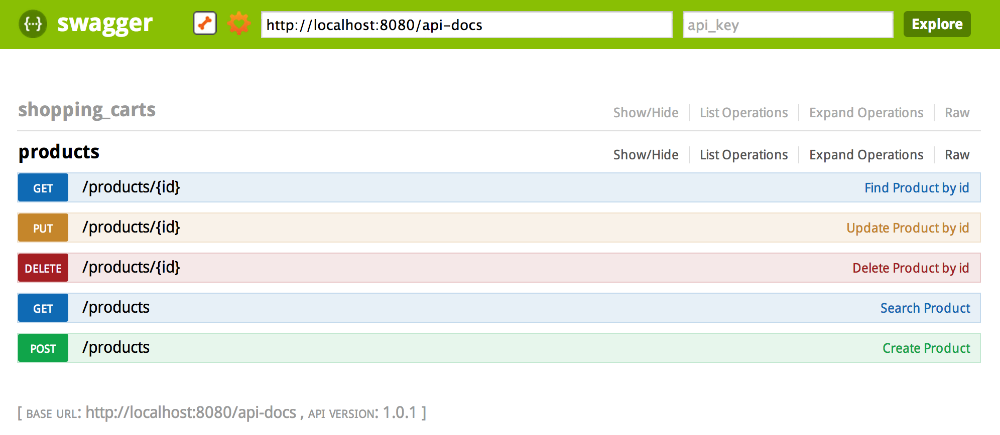

.. _getting-started:

Getting Started
===============

This guide will serve as basic introduction to installing Minnal and take you through the process of creating a simple Minnal project: *Shopping cart*. We will also take you through some of the important concepts and good practices around *domain modeling* along the way.

Shopping Cart Application
-------------------------
Our shopping cart application will expose the below API's,

.. table::
   
   =========================================================   ===========================
     	     API                     				Description
   =========================================================   ===========================
   POST /products           					Create a new product	
   GET /products	    					Get all the available products
   GET /products?title=<some title>    				Search the available products by title	
   POST /shopping_carts						Create a new shopping cart
   POST /shopping_carts/:id/items				Add items to the shopping cart
   PUT /shopping_carts/:id/items/:item_id			Update shopping cart item
   GET /shopping_carts/:id/items?product.title=<some title>	Search for items in the cart matching a title
   PUT /shopping_carts/:id/cancel				Cancel the shopping cart 
   =========================================================   ===========================

Creating the project
~~~~~~~~~~~~~~~~~~~~
Minnal command line utility can create a new project scaffold for us,

.. code-block:: bash

	$ minnal new shopping-cart
	2014-08-27 21:04:57,920 [main] [] [] DEBUG org.minnal.generator.MinnalGenerator - Running command new
	2014-08-27 21:04:57,925 [main] [] [] INFO  org.minnal.generator.core.ProjectGenerator - Creating the project shopping-cart under /Users/ganeshs
	2014-08-27 21:04:57,928 [main] [] [] INFO  org.minnal.generator.core.AbstractGenerator - Creating the folder src/main/java under /Users/ganeshs/shopping-cart
	2014-08-27 21:04:57,928 [main] [] [] INFO  org.minnal.generator.core.AbstractGenerator - Creating the folder src/test/java under /Users/ganeshs/shopping-cart
	2014-08-27 21:04:57,928 [main] [] [] INFO  org.minnal.generator.core.AbstractGenerator - Creating the folder src/main/resources under /Users/ganeshs/shopping-cart
	2014-08-27 21:04:57,928 [main] [] [] INFO  org.minnal.generator.core.AbstractGenerator - Creating the folder src/test/resources under /Users/ganeshs/shopping-cart
	2014-08-27 21:04:57,929 [main] [] [] INFO  org.minnal.generator.core.AbstractGenerator - Creating the folder src/main/resources/META-INF under /Users/ganeshs/shopping-cart
	2014-08-27 21:04:57,929 [main] [] [] INFO  org.minnal.generator.core.AbstractGenerator - Creating the folder src/main/resources/META-INF/services under /Users/ganeshs/shopping-cart
	2014-08-27 21:04:58,060 [main] [] [] INFO  org.minnal.generator.core.PomGenerator - Creating the pom file pom.xml
	2014-08-27 21:04:58,075 [main] [] [] INFO  org.minnal.generator.core.ContainerConfigGenerator - Creating the container config file /Users/ganeshs/shopping-cart/src/main/resources/META-INF/container.yml
	2014-08-27 21:04:58,077 [main] [] [] INFO  org.minnal.generator.core.ApplicationSpiGenerator - Creating the application spi file /Users/ganeshs/shopping-cart/src/main/resources/META-INF/services/org.minnal.core.Application
	2014-08-27 21:04:58,394 [main] [] [] INFO  org.minnal.generator.core.ApplicationConfigGenerator - Creating the application config file /Users/ganeshs/shopping-cart/src/main/resources/META-INF/shoppingcart.yml
	2014-08-27 21:04:58,407 [main] [] [] INFO  org.minnal.generator.core.AbstractTemplateGenerator - Creating the file /Users/ganeshs/shopping-cart/src/main/java/com/shopping/cart/ShoppingCartConfiguration.java
	2014-08-27 21:04:58,409 [main] [] [] INFO  org.minnal.generator.core.AbstractTemplateGenerator - Creating the file /Users/ganeshs/shopping-cart/src/main/java/com/shopping/cart/ShoppingCartApplication.java
	2014-08-27 21:04:58,409 [main] [] [] INFO  org.minnal.generator.core.AbstractTemplateGenerator - Creating the file /Users/ganeshs/shopping-cart/src/main/resources/log4j.properties
	
The command above just created a minnal project that can generate API’s from JPA models. The application has been configured to connect to an in-memory H2 database in MySQL mode.

Creating the domain classes
~~~~~~~~~~~~~~~~~~~~~~~~~~~
Let's now create the JPA domain models from the minnal command line utility,

.. code-block:: bash
	
	$ cd shopping-cart
	$ minnal generate Product -aggregateRoot -fields title:string:true price:double
	[INFO] Generating the model class Product under the package com.shopping.cart.domain
	[INFO] Creating the file /Users/ganeshs/shopping-cart/src/main/java/com/shopping/cart/domain/Product.java

	$ minnal generate ShoppingCart -aggregateRoot -fields customerId:string status:string
	[INFO] Generating the model class ShoppingCart under the package com.shopping.cart.domain
	[INFO] Creating the file /Users/ganeshs/shopping-cart/src/main/java/com/shopping/cart/domain/ShoppingCart.java
 
	$ minnal generate ShoppingCartItem -fields quantity:integer
	[INFO] Generating the model class ShoppingCartItem under the package com.shopping.cart.domain
	[INFO] Creating the file /Users/ganeshs/shopping-cart/src/main/java/com/shopping/cart/domain/ShoppingCartItem.java

We just created the required model classes for our application. The relationship between the models has to be still hand coded. If you map the domain modelling concepts we discussed earlier with this application, *ShoppingCart* & *ShoppingCartItem* form an aggregate with *ShoppingCart* as the aggregate root and *Product* will be an AggregateRoot on its own. Any entity class that's annotated with ``@AggregateRoot`` is treated as an aggregate root by minnal. The fields or getters marked with the Jpa annotations ``@OneToMany`` and ``@ElementCollection`` are treated as members of the aggregate.

.. tip::

   `Domain Driven Design Quickly <http://www.infoq.com/minibooks/domain-driven-design-quickly>`_, a free ebook, explains in detail about identifying the *aggregate roots* in a domain

Domain Modelling
~~~~~~~~~~~~~~~~
The code below shows the generated classes after adding the relationships, 

.. code-block:: java
	:linenos:
	:emphasize-lines: 1,44,50

	@AggregateRoot
	@Entity
	@Table(name="shopping_carts")
	@Access(AccessType.FIELD)
	public class ShoppingCart extends BaseDomain {

		private String customerId;

		private String status;

		@OneToMany(mappedBy = "cart", cascade = CascadeType.ALL, orphanRemoval=true)
		@JsonManagedReference
		private Set<ShoppingCartItem> items = new HashMap<ShoppingCartItem>();

		....
		....
		// Getters and Setters
	}
	 
	@Entity
	@Table(name="shopping_cart_items")
	@Access(AccessType.FIELD)
	public class ShoppingCartItem extends BaseDomain {

		private Integer quantity;

		@ManyToOne(fetch=FetchType.LAZY)
		@JoinColumn(name="cartId")
		@JsonBackReference
		private ShoppingCart cart;

		@ManyToOne(fetch=FetchType.LAZY)
		@JoinColumn(name="productId", insertable=false, updatable=false)
		@JsonIgnore
		private Product product;

		private Long productId;

		....
		....
		// Getters and Setters
	}
	 
	@AggregateRoot
	@Entity
	@Table(name="products")
	@Access(AccessType.FIELD)
	public class Product extends BaseDomain {

		@Searchable
		private String title;

		private String description;

		private Double price;

		private Integer quantity;

		....
		....
		// Getters and Setters
	}

.. hint::

	The base class BaseDomain extends the Model class from `ActiveJpa <https://github.com/ActiveJpa/activejpa>`_. *ActiveJpa is a java library that attempts to implement the active record pattern on top of JPA. It eliminates the need to create DAO or Repository classes and make programming DAL a lot more simpler*. Minnal recommends using JPA for DB access and provides a JPA plugin module with ActiveJpa integration.

Any field that's marked as @Searchable is considered as a parameter that can be searched upon. Minnal automatically exposes these as query params in your api and appends to the query. For instance, you can make an API call like below

.. code-block:: bash

	GET /products?title=SampleProduct
	 
	// Minnal would execute the below query to fetch the results for you
	// SELECT * from products where title = "SampleProduct"

.. tip::

	* The annotations @JsonManagedReference & @JsonBackReference are from Jackson that are used to mark parent-child relationship in a bi-directional association to avoid avoid cycles during serializations.
	* @JsonIgnore ignores the field during serialization

Let's add a domain operation to cancel the shopping cart and annotate the operation with @Action. This would instruct minnal to expose an API to cancel the cart

.. code-block:: java
	:linenos:
	:emphasize-lines: 15

	@AggregateRoot
	@Entity
	@Table(name="shopping_carts")
	@Access(AccessType.FIELD)
	public class ShoppingCart extends BaseDomain {
		....
		....
		// Fields, Getters and Setters
		....
	 
		// This method will expose the route /shopping_carts/:id/cancel
		// Your payload should be a json structure with keys mapping to the name of the method arguments
		// In this scenario the payload would be {"reason": "some cancellation reason"}
		// Minnal will automatically call this method with the reason taken from payload
		@Action(value="cancel")
		public void cancel(String reason) {
		    setStatus("cancelled");
		    // Additional operation on cancel
		}
	}

Testing the generated APIs
~~~~~~~~~~~~~~~~~~~~~~~~~~
Minnal can generate test cases for the APIs it created. These tests may not be sufficient enough to certify your APIs but can ensure high level functionality is working.

.. code-block:: bash

	$ minnal generate-tests -packages com.shopping.cart
	 
	2014-08-28 11:37:56,361 [main] INFO  org.minnal.generator.core.AbstractTemplateGenerator - Creating the file /Users/ganeshs/shopping-cart/src/test/java/com/shopping/cart/domain/generated/ProductResourceTest.java
	2014-08-28 11:37:56,523 [main] INFO  org.minnal.generator.core.AbstractTemplateGenerator - Creating the file /Users/ganeshs/shopping-cart/src/test/java/com/shopping/cart/domain/generated/ShoppingCartResourceTest.java

This would create tests *src/test/java* for all your resources. To run the tests,

.. code-block:: bash

	$ mvn test
	 
	Tests run: 15, Failures: 0, Errors: 0, Skipped: 0, Time elapsed: 9.01 sec
	Results :
	Tests run: 15, Failures: 0, Errors: 0, Skipped: 0
	[INFO] ------------------------------------------------------------------------
	[INFO] BUILD SUCCESS
	[INFO] ------------------------------------------------------------------------

Starting the server
~~~~~~~~~~~~~~~~~~~

That's it. We are good to start the server now. **But wait, I haven't written my DAO and controller classes?** You don't have to write them, minnal generates the API's at runtime. Creating domain classes is the minimum task you have to do with minnal. Let us start the server and look at the generated API's

.. code-block:: bash

	$ minnal start
	 
	2014-08-28 11:49:15,749 [main] INFO  org.minnal.core.Container - Starting the container
	2014-08-28 11:49:15,749 [main] INFO  org.minnal.core.server.Server - Starting the connectors
	2014-08-28 11:49:15,749 [main] INFO  org.minnal.core.server.AbstractHttpConnector - Starting the connector on the port 8080

View your APIs
~~~~~~~~~~~~~~
Minnal has support for `Swagger <https://github.com/wordnik/swagger-core/wiki>`_ api documentation. So you can view your api's from `swagger ui <http://petstore.swagger.wordnik.com/>`_. In the swagger ui, type in the url *http://localhost:8080/api-docs* to view the generated APIs

Customizing an API
~~~~~~~~~~~~~~~~~~
There are scenarios where the generated CRUD API is not sufficient and we want to provide a custom functionality. Minnal allows us to override any API just like you what how you would create an API without minnal. Let's customize the create shopping cart functionlity to do a  custom operation and return back a result. We will do this by creating a jax-rs resource class,

.. code-block:: java
	:linenos:

	package com.shopping.cart.resource;

	@Path("/shopping_carts")
	public class ShoppingCartResource {

	    @ApiOperation(value="Create shopping cart")
	    @POST
	    public Response createShoppingCart(ShoppingCart cart) {
		// custom logic to handle the creation
		return Response.ok(cart).build();
	    }
	}

Now all calls to *POST /shopping_carts* will be hitting our custom resource class.

